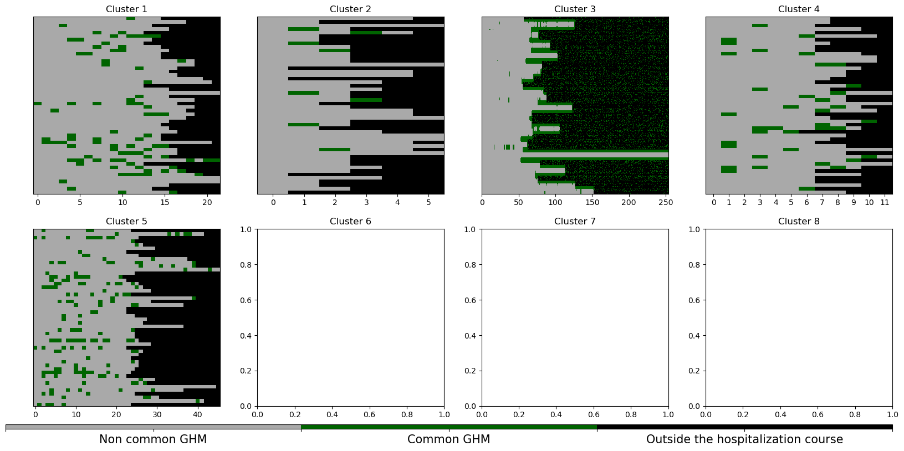
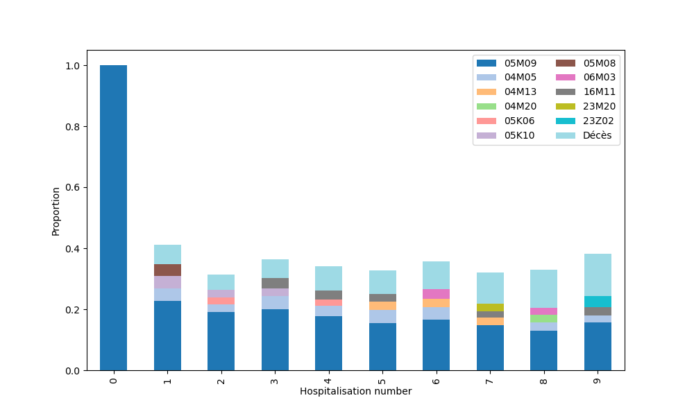
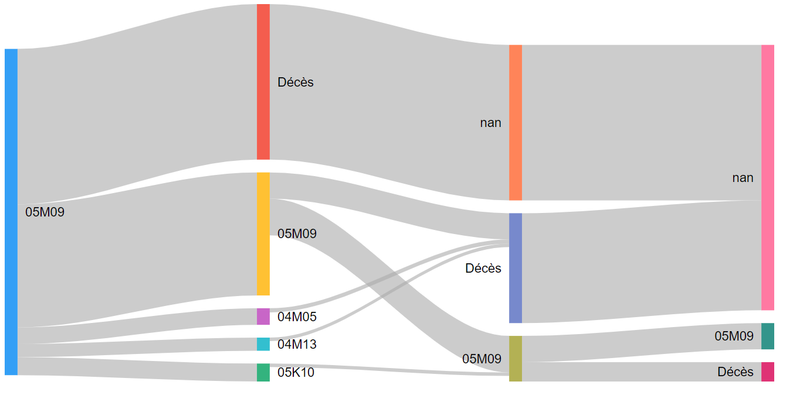
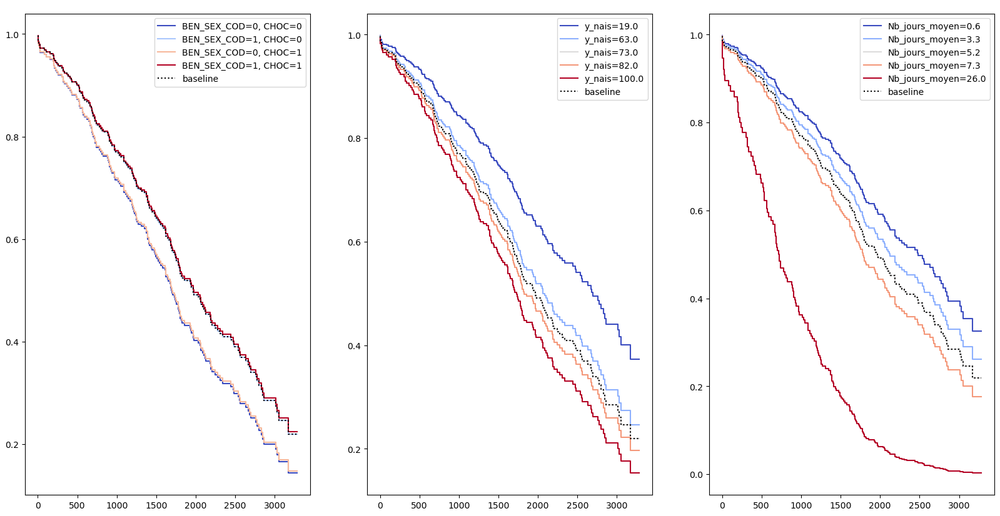
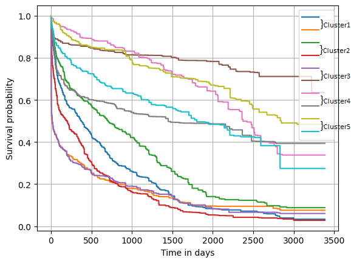

# Stat'App Project - ENSAE 2023

## Text mining and care pathway: what are the causes of mortality in heart failure patients?
<br/>
**Supervisors:** Dr. Anne-Isabelle Tropeano, Juliette Murris

*AP-HP & INSERM*

The objective of the study is to clarify the causes of mortality in heart failure patients, who are increasingly older. Knowing the main causes of mortality in these patients and their most frequent
care pathways will have a major public health impact. <br />
To answer our question, we first characterize the care pathways of patients through the study of sequential patterns: using GHM codes (Groupes Homogènes de Malades) defining hospitalizations, it is possible to find similarities in the care pathways, associated with a diagnosis. <br />
Once these pathways are identified, a survival analysis will predict the survival trajectory afterfirst hospitalization.

## Clustering
In order to obtain results more easily interpretable, and that would more easily respect the hypotheses of models that will be used later on, we decided to split the pool of patients into clusters. <br />
We used **K-Medoids** with a _**custom**_ metric: based on the information lying in the GHM codes, we created our own distance metric to assess the distance between different care pathways. <br />
How and why we constructed this metric is explained is the [project paper](/project_paper.pdf). <br /> <br />
 <br /> <br />
This will allow us to stratify our models on clusters; and this also allowed us to detect and set apart the outliers in the cluster 3. <br /> 
We can also check that clusters regroup patients similar with regards to our metric <br /><br />
<br /><br />
For each cluster:
- we select 50 patients randomly
- for each selected patient
    - for each GHM code in the health care pathway, we check if this code appears in the
hospitalization course of the patient medoid of the cluster
    - if so, the code will be displayed in green in the figure below
    - otherwise, it will be displayed in grey

In a nutshell, the more green there is, the better. Leaving cluster 3 aside, our clusters seem to do a good job.

## Pattern Mining
The aim of this section is to extract, through pattern mining, frequent health care pathway patterns, risky, or even
potentially lethal trajectories. <br />
Their identification will improve future predictions, as well as trying to better understand the causes of death in heart failure patients.
```
Sequential Pattern Mining is a data mining technique used to discover frequently occurring sequential patterns or
subsequences in a sequence database or time-series data; while taking into account the order of occurence.
```
With this technique, we obtained the most frequent jospitalization patterns for different temporal stamp lengths. <br />
We notably found that hospitalization for heart failure (’05M09’) is the last hospitalization before death in **33%** of care paths. <br /> <br />
 <br /> <br />
We could then use these findings to build Sankey diagrams, to view the patterns that are upstream of "Décès" (= death) <br /> <br />


## Survival Analysis
We finally try to build models to predict patients' life expectancy.
```
A model is called survival if it contains censored data.
```
### Cox Model
The **_Cox model_** is defined by the hazard function h
$$h(t) = h_o(t) \cdot exp\left(\sum_{i=1}^p b_ix_i \right)$$
It can be interpreted as the risk of dying at time t. <br/>
Stratifying the Cox model on the cluster defined earlier allowed for the hypothesis of said model to be respected. <br/>
We were able to fit a penalised Cox model, stratified by clusters, to get life expectancy curves.<br/><br/>


### Survival Random Forest
We also wanted to compare the predictions of the Cox Model with non-parametric ap-
proaches: the Survival Random Forest. <br/>
After a cross-validation phase to tune the hyperparameters, we could plot for each cluster the most and least optimistic trajectory, according to the model after fitting. <br/><br/>
<br/><br/>
However, it seems the non-parametric model that is Survival Random Forest does not bring more predictive power, while losing explainability; thus a Cox model seems more appropriate to this problem.
